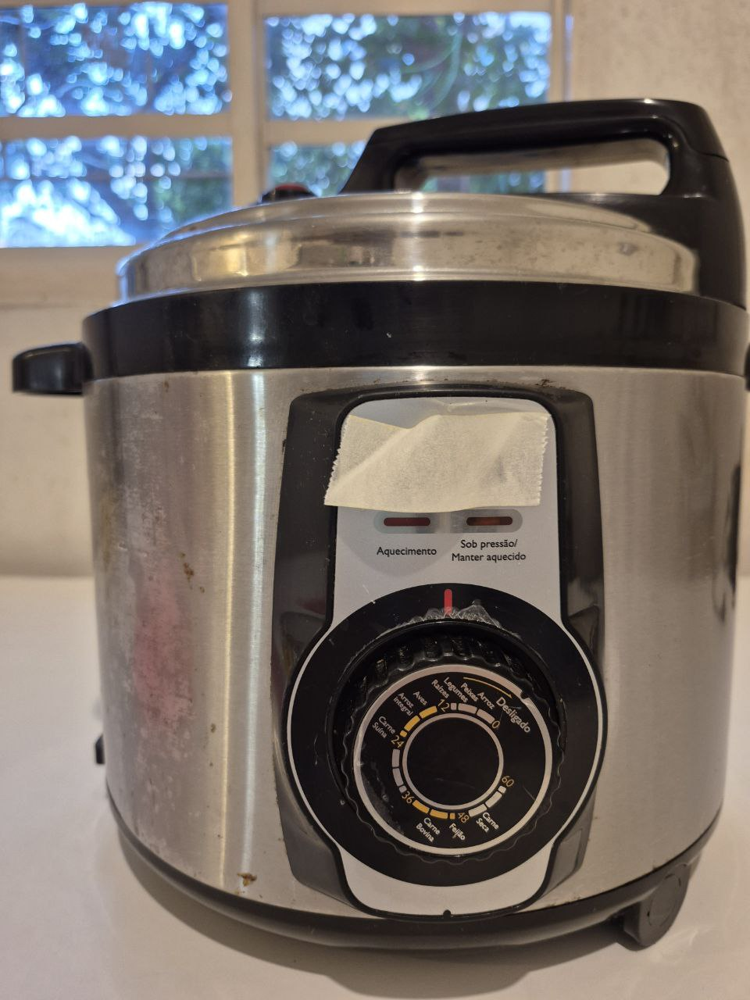
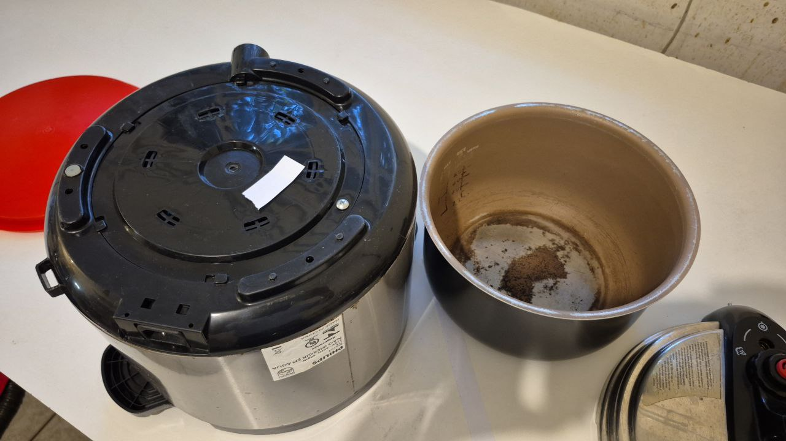
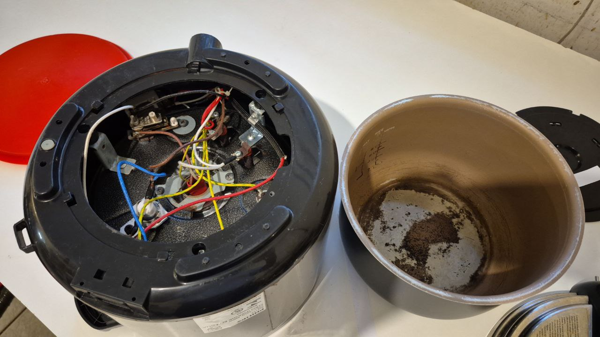
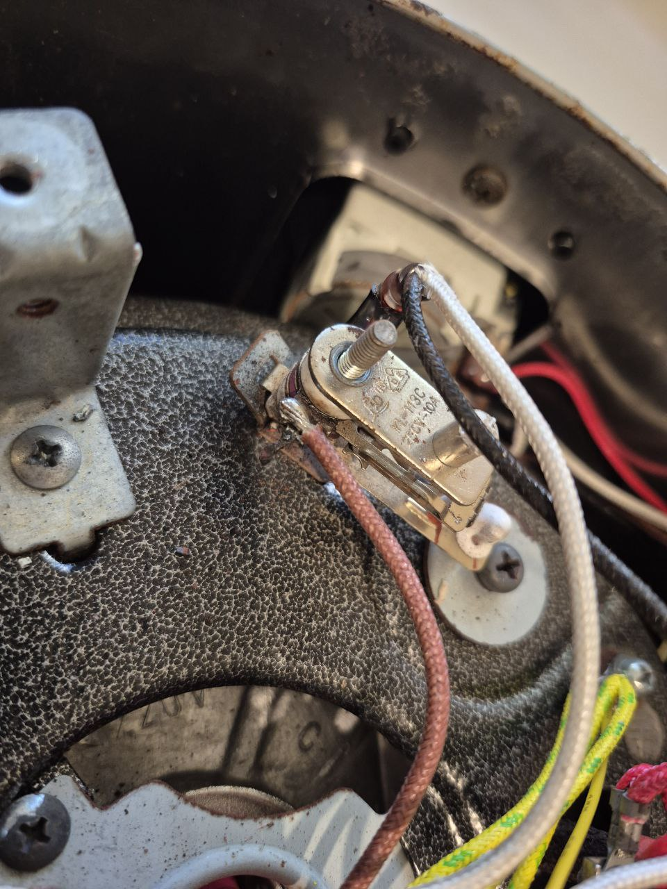

**Atenção**: esses consertos envolvem riscos, se não estiver disposto a corrê-los, procure um profissional para realizar o conserto. Você isenta o autor deste repositório de qualquer responsabilidade.

Esta panela não aquecia o suficiente para cozinhar ou para formar pressão: ligava na tomada e, qualquer que fosse a posição do timer, com ou sem tampa, o LED verde ficava aceso, não alternava para o LED vermelho (ou seria laranja?).

Este vídeo foi bastante elucidativo: https://www.youtube.com/watch?v=4z6OepCh5y4

Abrindo a tampa inferior, notei que o terminal do pressostato havia oxidado e quebrado. Como consequência o fio estava desconectado.

Limpei o que restou do terminal (havia o bastante para soldar o fio), preparei o fio e soldei o fio no que restou do terminal. Até onde testei a panela voltou a funcionar.

### Comentários

O aparelho tem uns dez anos de uso. Os terminais de muitos componentes estão oxidados.
